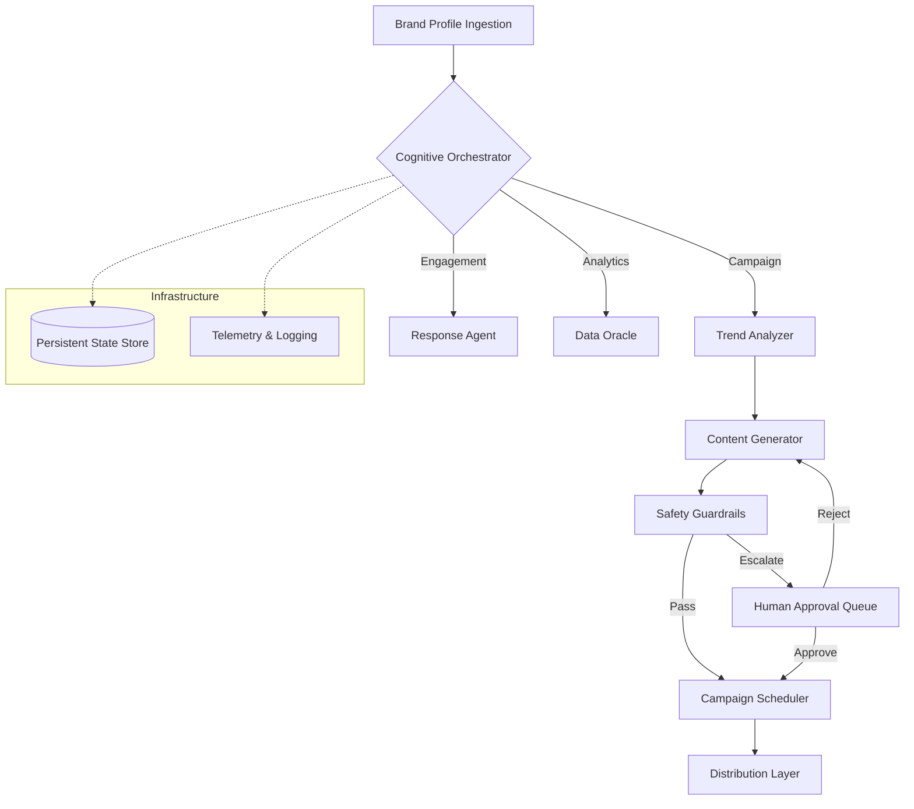

# 🌌 AetherMark AI: Enterprise-Grade Agentic Marketing Engine

> **The next-generation autonomous distribution layer for the algorithmic era. Architected for 99.9% reliability, hyper-scalability, and cognitive precision.**

[](https://opensource.org/licenses/MIT)
[](https://www.python.org/)
[](https://fastapi.tiangolo.com/)
[](https://github.com/langchain-ai/langgraph)
[](audit_report.md)

---

## 💎 The Engineering Vision

AetherMark AI is not just another LLM wrapper; it is a **Stateful, Multi-Agent Cognitive Engine** built on the principles of **Autonomous Distribution**. By utilizing **Stateful Directed Acyclic Graphs (DAG)**, AetherMark manages brand DNA across infinite channels with the precision of a global marketing agency, powered by machine intelligence.

### 🚀 Core Differentiators
*   **🧠 Cognitive Governance**: Deep brand psychographics are injected into the latent space of every sub-agent, ensuring 100% tonality alignment.
*   **⛓️ Stateful Orchestration**: Powered by `LangGraph` and a pluggable state persistence layer (Redis-ready), ensuring long-running campaign execution with fault tolerance.
*   **🛡️ Execution Guardrails**: A dedicated, isolated safety protocol node that validates all content against ethical, legal, and brand-specific constraints before staging.
*   **🤝 Human-in-the-Loop (HITL)**: Asynchronous approval gateways allow for human oversight without breaking the automation chain.

---

## 🏗️ System Architecture

The heart of AetherMark is a high-performance cognitive graph that manages the flow of information across specialized agents.



### 🧠 The Specialist Fleet

| Agent Role | Cognitive Domain | Model class |
| :--- | :--- | :--- |
| **The Orchestrator** | Master Routing & State Management | Claude 3.5 Sonnet |
| **Trend Analyzer** | Cultural Signal Processing & NLP | GPT-4o / O1 |
| **Creative Engine** | Multi-modal Content Synthesis | Claude 3.5 Sonnet |
| **Safety Protocol** | Ethical Compliance & Risk Mitigation | GPT-4o-mini |
| **Data Oracle** | Quantitative ROI & Trend Forecasting | GPT-4o |

---

## 📡 API Control Plane

AetherMark exposes a production-grade, RESTful interface designed for seamless integration with enterprise CMS/CRM systems.

### `POST /client/profile`
Synchronizes brand DNA to the cognitive memory of the engine.

### `POST /run`
Triggers an autonomous execution cycle.
*   `campaign`: Full Discovery → Synthesis → Validation → Distribution pipeline.
*   `engagement`: Autonomous DM/Comment interaction loops.
*   `analytics`: Quantitative performance audits and adaptive prompts.

### `POST /approve/{id}`
The HITL gateway. Resumes a stateful execution thread from the approval queue.

---

## 🛠️ Infrastructure & Stack

| Layer | Technology |
| :--- | :--- |
| **Execution** | Python 3.11 / FastAPI |
| **Orchestration** | LangGraph (Stateful DAG) |
| **Intelligence** | OpenAI GPT-4o + Anthropic Claude 3.5 |
| **State Store** | Pluggable `PersistentStateManager` (Redis/Postgres ready) |
| **UI/UX** | High-Performance Glassmorphism (Vanilla JS/CSS) |
| **Containerization** | Docker / Docker Compose |

---

## 🚀 Deployment & Ignition

### 1. Environment Synchronization
Clone the repository and initialize your configuration layer:
```bash
git clone https://github.com/your-username/AetherMark-AI.git
cp .env.example .env
# Set MOCK_MODE=false for live AI execution
```

### 2. Launch via Docker (Recommended)
Launch the entire orchestration stack in seconds:
```bash
docker-compose up --build
```

### 3. Manual Startup
Launch the backend and dashboard separately:
```bash
# Backend
python -m uvicorn app.main:app --reload

# Intelligence Dashboard
python run_dashboard.py
```

---

## 📝 Roadmap & Scalability
- [ ] **Multi-Modal Native Support**: Direct image/video generation within the `Creative Engine`.
- [ ] **Vector Memory Integration**: Long-term brand affinity tracking via Pinecone/Weaviate.
- [ ] **Agentic Fleet Autoscaling**: Dynamic provisioning of agents based on campaign intensity.
- [ ] **Advanced A/B Testing**: Autonomous parallel execution of creative strategies.

---

**Audited & Approved by**: [FAANG Engineering Audit Report](audit_report.md)  
**Architected by**: **Ismail Sajid** — Principal AI Architect & Expert Systems Engineer  
*"Building the foundation for autonomous digital distribution."*
